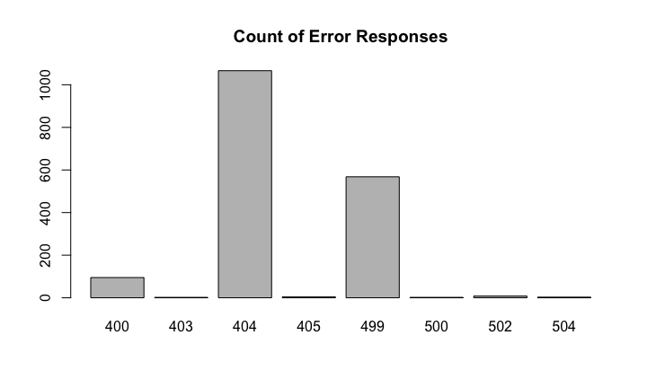

# Shutterstock Tech Talk
Jacob Emerick  
September 17, 2014  

## Introduction

A bit about Jacob.

 - on the Bigstock team as a backend engineer
 - play with PHP and such a lot
 - remote developer in Wisconsin

Thanks to Ryan Peterson, I've been learning R on the side.


## Learning R?

John Hopkins has an online series on [Data Science](https://www.coursera.org/specialization/jhudatascience/1).

 - the series is divided into ten month-long sessions
 - covers everything from basic R to mulitvariate models
 - it is free, though you can pay to get a pretty certification

I'm about 75% of the way through the series and hope to have one of those pretty certificates by the end of the year.


## Breakdown of Talk

This talk will be focused on exploratory analysis of access logs.

 - start w/ introduction on the technologies used
 - jump into processing and formatting of access log data
 - then go into exploring access log data


## Technology: RStudio

 - R is just a language, RStudio is a sweet IDE to play with R
 - you can get RStudio for free [on the internets](http://www.rstudio.com/)
 - R has a lot of packages to extend functionality
 - RStudio can help manage these packages
 - and it has a lot of helpful stuff, like graphing and environment tracking


## Technology: RMarkdown

 - is an expanded version of Markdown
 - chunks of R code are executed before compilation to Markdown
 - the R code can either be displayed or hidden for final publication
 - final publication can be slides, PDFs, Word, whatever
 - part of a whole area called Literate Statistical Programming
 - typically the raw RMarkdown is included with the presentation


## Technology: Access Logs

 - we'll be playing with typical Nginix logs
 - expanded Common Log Format
 - subset of Bigstock's logs, though almost any access logs could be plugged in
 - data processing may change based on format of access log


## Data Processing: Loading the Data


```r
# load and summarize the access log
# wd may vary based on where data is located
setwd('~/data-science/access-logs/')
access_log <- read.table('2014-09-03-01', nrows = 500000)
summary(access_log[, 2:5])
```

```
##  V2         V3                             V4              V5        
##  -:500000   -:500000   [03/Sep/2014:00:31:51:   158   -0400]:500000  
##                        [03/Sep/2014:01:00:42:   124                  
##                        [03/Sep/2014:01:21:12:   119                  
##                        [03/Sep/2014:01:24:45:   117                  
##                        [03/Sep/2014:00:31:52:   111                  
##                        [03/Sep/2014:01:50:45:   110                  
##                        (Other)              :499261
```


## Data Processing: Notes on Data Load

 - all objects are stored in memory
 - this doesn't work well with 'big data'... or access logs
 - best to loop through large sets, aggregating and summarizing, and clean up as you go


## Data Processing: Normalizing the Data


```r
# eliminate unwanted columns, merge date and time together
access_log <- access_log[,c('V4', 'V5', 'V6', 'V7', 'V8', 'V9',
                            'V10', 'V11', 'V12')]
access_log$V4 <- paste(access_log$V4, ' ', access_log$V5)
access_log$V4 <- strptime(access_log$V4, '[%d/%b/%Y:%H:%M:%S %z]')
access_log <- access_log[,c('V4', 'V6', 'V7', 'V8', 'V9', 'V10',
                            'V11', 'V12')]
colnames(access_log) <- c('date', 'request', 'response', 'size',
                          'referer', 'agent', 'ip', 'time')
```

Result is a 8 column data frame that is far too big and nasty to fit on a slide (request and referer strings).


## Exploring Data: Poking Around


```r
summary(access_log$time)
```

```
##    Min. 1st Qu.  Median    Mean 3rd Qu.    Max. 
##    0.00    0.13    0.19    0.31    0.30  180.00
```

```r
table(access_log$response)
```

```
## 
##    200    206    301    302    304    400    403    404    405    499 
## 479815     52   2993  14719    673     95      2   1066      4    568 
##    500    502    504 
##      2      8      3
```


## Exploring Data: Graphing Responses


```r
# break out only the 4** and 5** responses
error_filter <- grepl('^(4|5)', access_log$response)
barplot(table(access_log[error_filter,]$response),
    main = 'Count of Error Responses');
```

 


## Exploring Data: Error'd Agents


```r
error_agent <- as.character(access_log$agent)[error_filter]
error_agent <- sort(table(error_agent), decreasing = TRUE)[1:10]
substr(names(error_agent), start = 0, stop = 50)
```

```
##  [1] "Mozilla/5.0 (Windows NT 6.1; WOW64) AppleWebKit/53"
##  [2] "Mozilla/5.0 (Windows NT 6.1; WOW64; rv:31.0) Gecko"
##  [3] "Mozilla/5.0 (compatible; Googlebot/2.1; +http://ww"
##  [4] "Mozilla/5.0 (Macintosh; Intel Mac OS X 10_9_4) App"
##  [5] "Mozilla/5.0 (Windows NT 6.1; WOW64) AppleWebKit/53"
##  [6] "Mozilla/4.0"                                       
##  [7] "VRPS/$Rev: 43290 $"                                
##  [8] "Mozilla/5.0 (Windows NT 6.3; WOW64) AppleWebKit/53"
##  [9] "Mozilla/5.0 (Macintosh; Intel Mac OS X 10_9_4) App"
## [10] "Mozilla/5.0 (Windows NT 6.1) AppleWebKit/537.36 (K"
```


## Exploring Data: Error Response Times


```r
aggregate(
    time ~ response,
    data = access_log[error_filter,],
    FUN = 'mean')
```

```
##   response      time
## 1      400   0.07335
## 2      403   0.00200
## 3      404   0.22764
## 4      405   0.09775
## 5      499   2.55457
## 6      500   0.09200
## 7      502   0.06263
## 8      504 160.00267
```


## Exploring Data: Test Response Times

Let's assume that the means of error and non-error responses are equal (the null hypothesis). Let's try to reject that!


```r
error_response <- aggregate(time ~ response,
    data = access_log[error_filter,], FUN = 'mean')
nonerror_response <- aggregate(time ~ response,
    data = access_log[!error_filter,], FUN = 'mean')
t.test(error_response$time, nonerror_response$time,
    alternative = 'greater')$conf
```

```
## [1] -17.52    Inf
## attr(,"conf.level")
## [1] 0.95
```


## Exploring Data: Linear Modeling

We know that 504s account for a lot of response time. Can we fit a line to predict time based on response code?


```r
fit_response <- lm(time ~ response, data = access_log)
summary(abs(fit_response$residuals))
```

```
##    Min. 1st Qu.  Median    Mean 3rd Qu.    Max. 
##    0.00    0.09    0.14    0.23    0.21  179.00
```

Note: if you wanted to actually test the fit, you would split up your set and run training vs testing sets. Plus this data is very, very discrete. But this is for illustrative purposes only.


## Exploring Data: Fitting the Model


```r
plot(time ~ response, data = access_log, col = rgb(0, 0, 0, .2),
     pch = 20, main = 'Time vs Type')
lines(fit_response$fitted)
```

 


## Exploring Data: Checking on Size

What about the size of a response? Does that change the response time?


```r
summary(access_log$size)
```

```
##     Min.  1st Qu.   Median     Mean  3rd Qu.     Max. 
## 0.00e+00 1.80e+04 2.89e+04 6.14e+04 3.23e+04 3.16e+08
```


```r
access_log$size_kb <- access_log$size / 1000
size_filter <- access_log$size_kb > 10 & access_log$size_kb < 500
```


## Exploring Data: Fitting the Line


```r
fit_size <- lm(time ~ size_kb, data = access_log[size_filter,])
fit_size
```

```
## 
## Call:
## lm(formula = time ~ size_kb, data = access_log[size_filter, ])
## 
## Coefficients:
## (Intercept)      size_kb  
##    0.254774     0.000965
```


## Exploring Data: Checking Line by Size


```r
plot(time ~ size_kb, data = access_log[size_filter,],
     col = rgb(0, 0, 0, .2), pch = 20, main = 'Time v Size')
lines(fit_size$fitted)
```

 


## Summary

504 errors contribute heavily to the average response times in our nginx logs.

This makes sense, because 504 is Gateway Timeout Error.

Response size does not have a huge impact on time.

Oh, and Data Science is fun!


## Questions?

Presentation: [exploring access log slides](https://github.com/jacobemerick/exploring-access-logs-presentation)

Twitter: [jpemeric](http://twitter.com/jpemeric)
